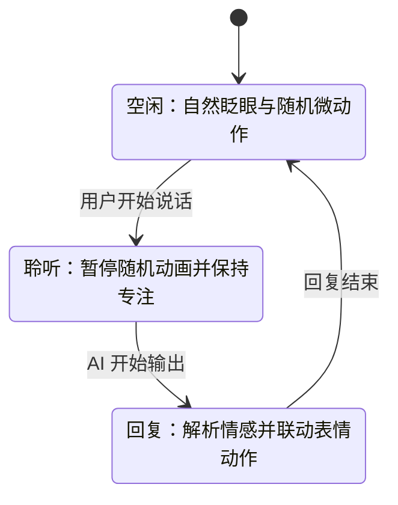
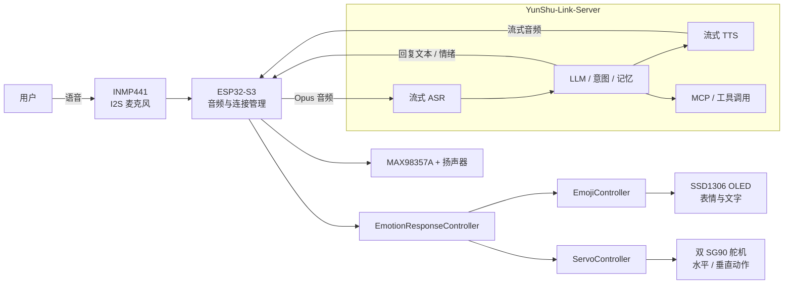

<div align="center">

# YunShu-Link-Firmware

### 云枢智能桌面机器人固件

**让 AI 不只会回答，更能用表情与动作表达。**

基于 ESP32-S3 打造的低成本、可自部署、具备情感表现力的智能桌面机器人。

[](https://www.espressif.com/zh-hans/products/socs/esp32-s3)
[](https://github.com/espressif/esp-idf)
[](main/boards/esp32-s3n16r8-emoji)
[](LICENSE)
[](https://github.com/KingYeon-Zoo/YunShu-Link)

[产品介绍](#产品介绍) · [核心创新](#核心创新) · [系统架构](#系统架构) · [硬件组成](#硬件组成) · [快速开始](#快速开始) · [开发说明](#开发说明)

</div>

---

## 产品介绍

**YunShu-Link-Firmware（云枢智能桌面机器人固件）** 是我们围绕 ESP32-S3 自主设计与开发的具身语音交互终端。它将实时语音对话、OLED 动态表情和双轴舵机动作整合到同一套嵌入式系统中，使大模型的回答能够从“声音输出”进一步转化为可感知的情绪与肢体反馈。

当云枢听到用户说话时，它会进入专注聆听状态；当 AI 思考或回复时，它会根据对话状态和回复内容呈现相应表情，并通过点头、摇头、转向等动作加强语义表达；在无人交互时，它还会自然眨眼和随机观察周围，让设备保持“在场感”。

项目可与自研后端 [YunShu-Link-Server](https://github.com/KingYeon-Zoo/YunShu-Link) 组成完整链路：

```text
用户语音 → ESP32-S3 采集 → 云端 ASR → LLM 推理 → TTS 合成
        ← 扬声器播放 + OLED 表情 + 双轴舵机动作 ← 情感与意图解析
```

### 我们想解决什么问题

传统智能音箱主要依赖声音反馈，用户很难直观判断设备是在聆听、思考、回复还是待机。部分桌面机器人虽然具备屏幕或舵机，但表情、动作与对话内容往往相互独立，容易出现“嘴上在回答，身体却在做无关动作”的割裂体验。

云枢把**对话状态、语义情感、视觉表情和机械动作**统一编排，让机器人能够以更自然、更具亲和力的方式参与交流。

## 30 秒了解云枢

| 能力 | 产品表现 | 技术实现 |
|---|---|---|
| 实时对话 | 支持实时语音问答与流式播放 | I2S 音频、Opus、WebSocket / MQTT + UDP |
| 情感表达 | 回复内容驱动开心、悲伤、惊讶、思考等表情 | 情感映射与文本意图解析 |
| 具身动作 | 点头、摇头、抬头、低头、左右观察、转圈 | 双 SG90 舵机 + LEDC PWM |
| 状态感知 | 聆听、说话、空闲阶段呈现不同的行为 | 设备状态监控与行为调度 |
| 自然待机 | 自动眨眼并随机执行轻量动作 | FreeRTOS 定时任务与动画队列 |
| 双重交互 | 对话界面与沉浸式表情界面一键切换 | LVGL 多 Screen 管理 |
| 开放连接 | 可接入自研服务端并扩展设备能力 | WebSocket / MQTT + UDP 与 MCP 生态 |
| 远程维护 | 支持从自建服务获取固件更新 | OTA 升级机制 |

## 核心创新

### 1. 从“语音助手”到“情感具身终端”

项目没有把 OLED 和舵机当作彼此独立的外设，而是设计了统一的情感动作映射层：

- 接收大模型回复文本和框架情绪标记；
- 识别肯定、否定、方向、休息、庆祝等语义；
- 将语义转换为表情动画与头部动作；
- 让声音、表情和动作共同完成一次回复。

例如，表达肯定时可以配合点头，表达否定时可以配合摇头，思考时显示专注表情，结束对话后再平滑回到中性状态。

### 2. 对话状态感知的行为调度

机器人不是简单地循环播放动画。系统实时监听 `Idle / Listening / Speaking` 状态，并据此调整行为：



对话开始后，随机动画会立即暂停并清空队列，避免无关动作干扰交流；对话结束后，系统恢复中性表情，并重新启用自然待机行为。

### 3. 面向资源受限设备的并发动画系统

ESP32-S3 需要同时处理网络、音频、屏幕刷新和舵机控制。为避免动画阻塞实时语音链路，我们将行为系统拆分为多个职责清晰的控制器：

- `EmojiController`：管理 LVGL 表情、眨眼和动画队列；
- `ServoController`：管理双轴角度、安全边界与平滑移动；
- `EmotionResponseController`：完成文本、情绪与动作映射；
- `StateMonitorTask`：感知设备状态并协调动画启停；
- 独立 FreeRTOS 任务执行动画，降低对主交互流程的影响。

### 4. 低成本硬件实现多模态表达

云枢使用常见且易获得的模块完成完整交互：ESP32-S3、SSD1306 OLED、INMP441 数字麦克风、MAX98357A 音频功放和两只 SG90 舵机。无需高算力端侧主机，也能实现“听、说、看、动”四类反馈。

舵机控制加入了活动范围限制与逐步插值：水平轴限制在中心点左右约 40°，垂直轴限制在中心点上下约 20°，在保持动作表现力的同时降低碰撞和堵转风险。

### 5. 端云一体、可自部署的完整闭环

固件不是孤立的硬件 Demo。它可以与 YunShu-Link-Server 配套运行，将设备接入、实时音频、ASR、LLM、TTS、记忆、工具调用和 OTA 更新串联起来。开发者既可以替换模型服务，也可以继续扩展新的情感、动作和外设。

## 与常见方案的差异

| 对比维度 | 常见语音终端 | YunShu-Link-Firmware |
|---|---|---|
| 交互反馈 | 以语音或文字为主 | 语音 + 表情 + 双轴动作协同表达 |
| 动画逻辑 | 固定循环或手动触发 | 由对话状态和回复语义共同驱动 |
| 实时性 | 动画可能阻塞其他任务 | FreeRTOS 任务与消息队列解耦 |
| 设备成本 | 依赖高性能主机或复杂机械结构 | 基于通用 ESP32-S3 与低成本模块 |
| 服务依赖 | 通常绑定单一云服务 | 支持自建 YunShu-Link-Server |
| 可扩展性 | 表情和动作逻辑较封闭 | 控制器分层，可继续添加动作与传感器 |

## 系统架构



### 一次完整交互如何发生

1. 用户按键或唤醒设备，ESP32-S3 通过 I2S 采集语音。
2. 音频编码后发送至服务端，由 ASR 转写并交给大模型处理。
3. 服务端返回流式语音，同时下发回复文本或情绪信息。
4. 设备播放语音，并由情感控制器解析回复内容。
5. 表情控制器和舵机控制器协同执行对应反馈。
6. 回复结束后，设备回到中性状态，并在空闲阶段恢复自然动画。

## 功能特性

### 语音与连接

- 实时语音采集与播放；
- Opus 音频编解码；
- WebSocket 与 MQTT + UDP 通信；
- Wi-Fi 配网与设备接入；
- 支持接入 YunShu-Link-Server；
- 支持 OTA 固件更新。

### 表情系统

- 支持自然眨眼、开心、悲伤、愤怒、惊讶、困惑、思考、睡眠、唤醒等表情；
- 支持左右观察、哭泣、大笑、喜爱、亲吻、放松、自信等扩展动画；
- 支持随机单次眨眼和连续快速眨眼；
- 支持对话界面与全屏表情界面切换；
- 动画通过队列串行调度，减少状态冲突。

### 动作系统

- 双轴头部运动：左右、上下与自动回正；
- 点头、摇头、环绕和组合舞蹈动作；
- 舵机角度安全限制；
- 逐步移动，降低机械冲击；
- 表情与动作组合执行。

### 交互控制

- 短按 `BOOT`：开始或停止对话；
- 长按 `BOOT`：切换对话模式与表情模式；
- 音量按键：分级调节、最大音量和静音；
- 语音控制音量：支持设置指定音量、增大、减小和静音；
- 语义动作指令：支持点头、摇头、向左看、向右看、抬头、低头、回正和跳舞等表达。

## 硬件组成

### 推荐物料

| 模块 | 推荐型号 | 作用 |
|---|---|---|
| 主控 | ESP32-S3 N16R8 | 网络、音频、显示与动作调度 |
| 麦克风 | INMP441 | I2S 数字语音采集 |
| 音频功放 | MAX98357A | I2S 音频输出与扬声器驱动 |
| 显示屏 | SSD1306 128 × 64 OLED | 文字状态与动态表情 |
| 舵机 | SG90 × 2 | 水平与垂直头部运动 |
| 扬声器 | 4Ω / 3W 或同类规格 | 语音播放 |
| 按键 | BOOT、音量加、音量减 | 本地交互控制 |

PCB 设计参考：[赛博太白 DeskEmoji ESP32-S3 适配板](https://oshwhub.com/jorellee/xiao-zhi-ai-ji-qi-ren-deskemoji-da-ban)。

### 引脚连接

| 外设 | 信号 | ESP32-S3 引脚 |
|---|---|---|
| INMP441 | WS / SCK / SD | GPIO4 / GPIO5 / GPIO6 |
| MAX98357A | DIN / BCLK / LRC | GPIO7 / GPIO15 / GPIO16 |
| SSD1306 | SDA / SCL | GPIO41 / GPIO42 |
| 水平舵机 | PWM | GPIO11 |
| 垂直舵机 | PWM | GPIO12 |
| 音量增加 | Button | GPIO40 |
| 音量减少 | Button | GPIO39 |
| 模式 / 对话 | BOOT | GPIO0 |
| 状态灯 | LED | GPIO48 |

> [!WARNING]
> SG90 舵机建议使用独立、稳定的 5V 电源供电，并与 ESP32-S3 共地。不要直接从开发板的 3.3V 引脚为舵机供电，否则可能出现重启、音频噪声或舵机抖动。

更完整的硬件说明见 [`main/boards/esp32-s3n16r8-emoji/README.md`](main/boards/esp32-s3n16r8-emoji/README.md)。

## 快速开始

### 1. 准备开发环境

- ESP-IDF 5.4 或更高版本；
- Python 3；
- Git；
- 支持数据传输的 USB 线；
- ESP32-S3 N16R8 及上述外设。

ESP-IDF 安装方式请参考[乐鑫官方文档](https://docs.espressif.com/projects/esp-idf/zh_CN/latest/esp32s3/get-started/index.html)。

### 2. 获取源码

```bash
git clone https://github.com/KingYeon-Zoo/YunShu-Link-Firmware.git
cd YunShu-Link-Firmware
```

### 3. 选择目标芯片与开发板

```bash
idf.py set-target esp32s3
idf.py menuconfig
```

在配置菜单中选择：

```text
Xiaozhi Assistant
└── Board Type
    └── ESP32-S3N16R8-EMOJI 表情机器人开发板
```

### 4. 编译并烧录

```bash
idf.py build
idf.py -p /dev/ttyUSB0 flash monitor
```

请根据操作系统修改串口名称：

- Linux 常见为 `/dev/ttyUSB0` 或 `/dev/ttyACM0`；
- macOS 常见为 `/dev/cu.usbmodem*`；
- Windows 常见为 `COM3`、`COM4` 等。

### 5. 连接服务端

本项目推荐配合 [YunShu-Link-Server](https://github.com/KingYeon-Zoo/YunShu-Link) 使用。服务端负责 ASR、LLM、TTS、记忆、工具调用与设备管理，固件负责实时音频和具身交互表现。

设备首次启动后按屏幕提示完成配网和绑定，即可开始对话。

## 代码结构

本项目的核心产品代码位于：

```text
main/boards/esp32-s3n16r8-emoji/
├── emoji_board.cc                   # 板级入口与设备状态编排
├── board_config.h                   # 引脚、音频、显示和舵机参数
├── emoji_controller.h/.cc           # OLED 表情与动画队列
├── servo_controller.h/.cc           # 双轴舵机动作控制
├── emotion_response_controller.h/.cc # 情感、文本与动作映射
├── config.json                      # ESP32-S3 构建配置
└── README.md                        # 开发板接线与使用说明
```

相关通用模块：

```text
main/audio/                           # 音频采集、编解码与处理
main/protocols/                       # WebSocket / MQTT 通信
main/display/                         # OLED / LCD 显示抽象
main/mcp_server.*                     # 设备端 MCP 能力
main/ota.*                            # OTA 更新
docs/                                 # 协议与开发文档
```

## 开发说明

### 新增表情

1. 在 `AnimationType` 中增加动画类型；
2. 在 `EmojiController` 中实现绘制或运动过程；
3. 在动画任务的分发逻辑中注册新动画；
4. 在 `EmotionResponseController` 中配置情感映射。

### 新增头部动作

1. 在 `ServoController` 中实现动作序列；
2. 保持舵机角度在安全范围内；
3. 在情感动作映射中关联语义或情绪；
4. 在真实结构上验证供电、方向和机械限位。

### 适配其他硬件

项目延续可插拔的板级架构。新增硬件时，可在 `main/boards/` 下创建独立目录，并在 `main/Kconfig.projbuild` 与 `main/CMakeLists.txt` 中注册对应开发板。

## 未来规划

- [ ] 增加实机演示视频与免环境固件下载；
- [ ] 完善外壳、结构件与装配文档；
- [ ] 增加手势传感器等非接触交互方式；
- [ ] 扩展视觉感知与主动观察能力；
- [ ] 增加更多可配置表情和动作组合；
- [ ] 完善自动化构建与硬件在环测试。

## 项目来源与原创说明

YunShu-Link-Firmware 的产品定义、ESP32-S3N16R8-Emoji 板级适配、双轴舵机控制、OLED 动态表情、情感动作映射、对话状态调度以及 YunShu-Link-Server 联调由本项目团队完成。

项目的通用语音通信框架基于开源项目 [78/xiaozhi-esp32](https://github.com/78/xiaozhi-esp32) 持续开发。我们感谢原项目及 ESP-IDF、LVGL 等开源社区提供的基础能力。保留清晰的开源来源不仅是许可证要求，也是本项目坚持开放协作与可复现工程实践的一部分。

## 参与贡献

欢迎通过 Issue 或 Pull Request 参与改进：

- 新的表情与动作设计；
- 新开发板和外设适配；
- 交互体验与稳定性优化；
- 文档、教程与实机案例；
- Bug 修复与性能改进。

提交代码前，请尽量保持现有 C++ 风格，并说明测试所使用的硬件与 ESP-IDF 版本。

## 开源许可

本项目使用 [MIT License](LICENSE) 开源。

---

<div align="center">

**YunShu-Link · 让智能从云端抵达真实世界**

如果这个项目对你有帮助，欢迎点亮一个 ⭐。

</div>
