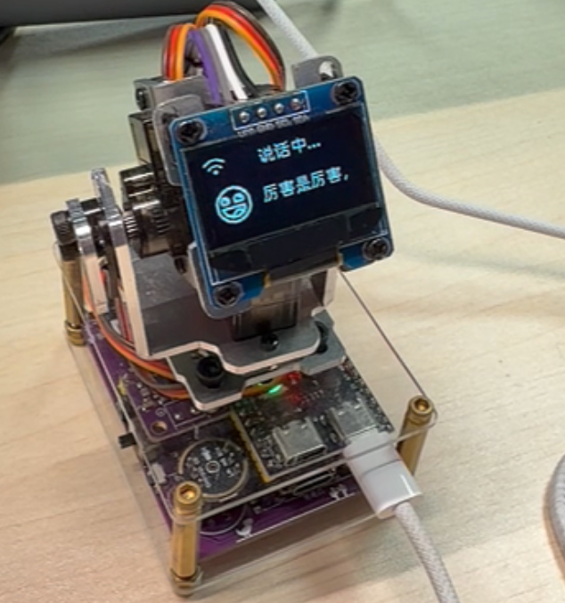
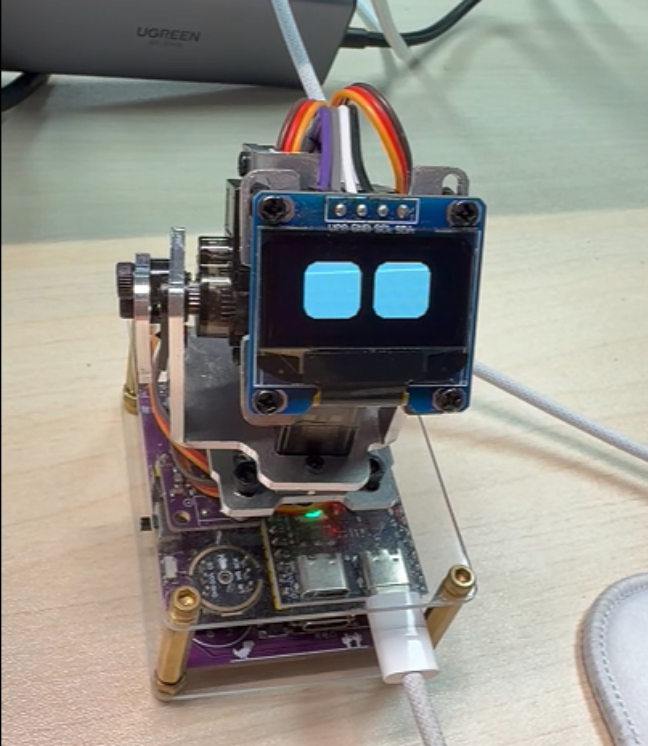

# YunShu-Link 云枢固件

**运行在 ESP32-S3 上的桌面机器人固件，将语音交互接到 OLED 表情与双轴头部动作。**

设备采集声音、播放回复并呈现交互状态，云端负责语音识别与模型推理。固件与 [YunShu-Link 服务端](https://github.com/KingYeon-Zoo/YunShu-Link) 配合，组成可自行部署的机器人交互系统。

<p align="center">
  
  
</p>

[观看系统演示](https://github.com/KingYeon-Zoo/YunShu-Link/releases/tag/demo-2026) · [服务端仓库](https://github.com/KingYeon-Zoo/YunShu-Link) · [硬件与烧录](docs/硬件与烧录.md) · [代码导览](#代码导览)

## 设备负责什么

- **语音收发：** 通过 I2S 采集与播放音频，连接服务端完成语音对话。
- **状态表达：** 在文字状态和 OLED 表情之间切换，呈现聆听、回复与待机状态。
- **头部动作：** 控制水平与垂直舵机，组合点头、摇头、转向等动作。
- **本地交互：** 通过按键控制对话、显示模式和音量，保留设备侧交互入口。

## 核心设计

### 板级适配与通用通信分开

通用音频、网络和协议能力沿用小智固件框架。云枢的硬件适配集中在 `esp32-s3n16r8-emoji` 板级目录，显示、舵机和情绪响应分别由控制器管理，便于定位硬件差异与交互问题。

### 表情和动作接入对话状态

情绪响应控制器根据消息与交互状态协调显示及动作，舵机控制器负责具体运动。音频、显示和动作各有执行任务，设计时需要控制这些任务之间的阻塞与资源竞争。

### MCP 与具身工具的版本对应

默认分支包含 MCP 协议处理和设备状态、音量等通用工具。

项目的[具身工具扩展版本](https://github.com/KingYeon-Zoo/YunShu-Link-Firmware/tree/ca53cf5dea1f20cbb2b22214ea2bc0d4b9a068f6)进一步把头部动作、表情与显示模式注册为模型工具：`self.head.perform_action`、`self.face.set_emotion`、`self.face.set_mode`。对应实现见该版本的 [emoji_board.cc](https://github.com/KingYeon-Zoo/YunShu-Link-Firmware/blob/ca53cf5dea1f20cbb2b22214ea2bc0d4b9a068f6/main/boards/esp32-s3n16r8-emoji/emoji_board.cc)。

两套入口保留明确版本，编译前请按需要选择。

## 代码导览

| 模块 | 实现入口 |
| --- | --- |
| 板级初始化与外设装配 | [emoji_board.cc](main/boards/esp32-s3n16r8-emoji/emoji_board.cc) |
| OLED 表情 | [emoji_controller.cc](main/boards/esp32-s3n16r8-emoji/emoji_controller.cc) |
| 双轴动作 | [servo_controller.cc](main/boards/esp32-s3n16r8-emoji/servo_controller.cc) |
| 消息与情绪响应 | [emotion_response_controller.cc](main/boards/esp32-s3n16r8-emoji/emotion_response_controller.cc) |
| MCP 协议与通用设备工具 | [mcp_server.cc](main/mcp_server.cc) |
| 音频与通信协议 | [audio/](main/audio/)、[protocols/](main/protocols/) |

## 编译与接入

主要硬件为 ESP32-S3 N16R8、INMP441 麦克风、MAX98357A 功放、SSD1306 OLED 与两只 SG90 舵机。物料、接线和供电要求见[硬件与烧录说明](docs/硬件与烧录.md)。

在已配置 ESP-IDF 5.4+ 的终端中：

```bash
git clone https://github.com/KingYeon-Zoo/YunShu-Link-Firmware.git
cd YunShu-Link-Firmware
idf.py set-target esp32s3
idf.py menuconfig
idf.py build
```

在 `menuconfig` 中选择 `ESP32-S3N16R8-EMOJI` 开发板，并配置自己的服务端地址。烧录命令和串口选择见[详细步骤](docs/硬件与烧录.md)。

需要具身 MCP 工具扩展时，先检出对应版本，再执行上述配置与编译步骤：

```bash
git checkout ca53cf5dea1f20cbb2b22214ea2bc0d4b9a068f6
```

## 项目来源与改造

固件基于 [78/xiaozhi-esp32](https://github.com/78/xiaozhi-esp32) 开发，云枢围绕 Emoji 开发板完成显示、双轴舵机、情绪响应和交互适配，并在扩展版本中加入具身设备工具。

硬件适配参考[赛博太白 DeskEmoji 适配板](https://oshwhub.com/jorellee/xiao-zhi-ai-ji-qi-ren-deskemoji-da-ban)。项目保留上游版权声明，许可证见 [LICENSE](LICENSE)。
